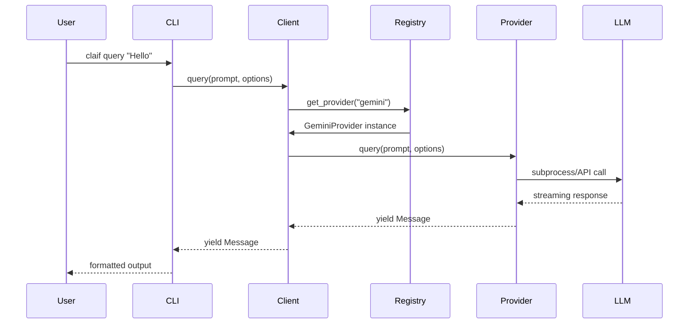

# Claif Architecture Overview

This document provides a comprehensive overview of the Claif framework's architecture, design patterns, and core components.

## System Architecture

### High-Level Overview

```
┌─────────────────────────────────────────────────────────────┐
│                        User Applications                      │
├─────────────────────────────────────────────────────────────┤
│                         Claif CLI                             │
│                    (Fire-based interface)                     │
├─────────────────────────────────────────────────────────────┤
│                      Claif Python API                         │
│                   (Async client library)                      │
├─────────────────────────────────────────────────────────────┤
│                      Claif Core Framework                     │
│  ┌─────────────┬──────────────┬─────────────┬─────────────┐ │
│  │   Plugin    │   Provider   │   Common    │    MCP      │ │
│  │   System    │   Registry   │   Types     │   Server    │ │
│  └─────────────┴──────────────┴─────────────┴─────────────┘ │
├─────────────────────────────────────────────────────────────┤
│                      Provider Packages                        │
│  ┌─────────────┬──────────────┬─────────────┬─────────────┐ │
│  │ claif_cla   │  claif_gem   │  claif_cod  │   Future    │ │
│  │  (Claude)   │  (Gemini)    │  (Codex)    │  Providers  │ │
│  └─────────────┴──────────────┴─────────────┴─────────────┘ │
├─────────────────────────────────────────────────────────────┤
│                    External LLM Services                      │
│  ┌─────────────┬──────────────┬─────────────┬─────────────┐ │
│  │  Claude     │   Gemini     │   Codex     │   Others    │ │
│  │  Code CLI   │     CLI      │     CLI     │             │ │
│  └─────────────┴──────────────┴─────────────┴─────────────┘ │
└─────────────────────────────────────────────────────────────┘
```

### Core Design Principles

1. **Plugin-Based Architecture**
   - Providers are discovered automatically via Python entry points
   - No hardcoded provider dependencies in core
   - Hot-swappable provider implementations

2. **Async-First Design**
   - All I/O operations are async
   - Built on `asyncio` and `anyio`
   - Supports concurrent provider queries

3. **Type Safety**
   - Comprehensive type hints throughout
   - Runtime type validation
   - IDE-friendly development

4. **Separation of Concerns**
   - Core framework handles routing and common functionality
   - Providers handle LLM-specific implementation
   - Common types ensure interoperability

## Component Architecture

### 1. Plugin System

The plugin system is the heart of Claif's extensibility:

```python
# Entry point registration in provider's pyproject.toml
[project.entry-points."claif.providers"]
gemini = "claif_gem:GeminiProvider"
```

**Key Components:**

- **Provider Discovery**: Automatic scanning of installed packages
- **Lazy Loading**: Providers loaded only when needed
- **Version Checking**: Compatibility verification
- **Graceful Degradation**: Missing providers don't crash the system

**Implementation Details:**

```python
# src/claif/providers/__init__.py
def discover_providers() -> dict[str, type[BaseProvider]]:
    """Discover all installed provider plugins."""
    providers = {}
    
    for entry_point in entry_points(group="claif.providers"):
        try:
            provider_class = entry_point.load()
            providers[entry_point.name] = provider_class
        except Exception as e:
            logger.warning(f"Failed to load provider {entry_point.name}: {e}")
    
    return providers
```

### 2. Provider Interface

All providers must implement the `BaseProvider` abstract class:

```python
class BaseProvider(ABC):
    """Abstract base class for all Claif providers."""
    
    @abstractmethod
    async def query(
        self,
        prompt: str,
        options: ClaifOptions | None = None
    ) -> AsyncIterator[Message]:
        """Execute a query and yield response messages."""
        
    @abstractmethod
    async def connect(self) -> None:
        """Establish connection to the provider."""
        
    @abstractmethod
    async def disconnect(self) -> None:
        """Clean up provider resources."""
        
    @property
    @abstractmethod
    def name(self) -> str:
        """Provider identifier."""
        
    @property
    def capabilities(self) -> set[str]:
        """Provider capabilities (e.g., 'vision', 'tools')."""
        return set()
```

### 3. Message System

Claif uses a unified message format across all providers:

```python
@dataclass
class Message:
    """Universal message format."""
    role: Role  # SYSTEM, USER, ASSISTANT
    content: str | list[ContentBlock]
    metadata: dict[str, Any] | None = None

@dataclass
class ContentBlock(ABC):
    """Base class for content blocks."""
    pass

@dataclass
class TextBlock(ContentBlock):
    """Plain text content."""
    text: str

@dataclass
class ImageBlock(ContentBlock):
    """Image content."""
    data: bytes
    mime_type: str

@dataclass
class ToolUseBlock(ContentBlock):
    """Tool invocation request."""
    tool_name: str
    parameters: dict[str, Any]
```

### 4. Configuration System

Hierarchical configuration with multiple sources:

```
Priority (highest to lowest):
1. CLI arguments
2. Environment variables  
3. Config file (~/.claif/config.toml)
4. Provider defaults
```

**Configuration Schema:**

```toml
[general]
default_provider = "gemini"
timeout = 120
log_level = "INFO"

[providers.gemini]
api_key = "${GOOGLE_API_KEY}"  # Environment variable reference
model = "gemini-pro"
temperature = 0.7

[providers.claude]
api_key = "${ANTHROPIC_API_KEY}"
model = "claude-3-sonnet"
session_dir = "~/.claif/sessions"
```

### 5. Error Handling

Comprehensive error hierarchy for better debugging:

```
ClaifError (base)
├── ConfigurationError
│   ├── MissingAPIKeyError
│   └── InvalidConfigError
├── ProviderError  
│   ├── ProviderNotFoundError
│   ├── ProviderInitError
│   └── ProviderRuntimeError
├── TransportError
│   ├── ConnectionError
│   ├── TimeoutError
│   └── RateLimitError
└── InstallError
    ├── DependencyError
    └── PermissionError
```

## Data Flow

### Query Execution Flow



### Provider Loading Flow

```python
# 1. Entry point discovery
providers = discover_providers()

# 2. Lazy instantiation
provider = providers[name]()

# 3. Connection establishment
await provider.connect()

# 4. Query execution
async for message in provider.query(prompt):
    yield message

# 5. Cleanup
await provider.disconnect()
```

## Async Architecture

### Concurrency Model

Claif uses `asyncio` for concurrency with `anyio` for compatibility:

```python
# Concurrent provider queries
async def query_all(prompt: str) -> dict[str, list[Message]]:
    tasks = []
    for provider_name in get_available_providers():
        task = query_provider(provider_name, prompt)
        tasks.append(task)
    
    results = await asyncio.gather(*tasks, return_exceptions=True)
    return process_results(results)
```

### Stream Processing

All providers support streaming responses:

```python
async def stream_response(provider, prompt):
    async for message in provider.query(prompt):
        # Process each message as it arrives
        yield format_message(message)
```

## Extension Points

### 1. Custom Providers

Create a new provider by implementing `BaseProvider`:

```python
from claif.providers.base import BaseProvider

class MyProvider(BaseProvider):
    async def query(self, prompt, options=None):
        # Implementation
        yield Message(role=Role.ASSISTANT, content="Response")
```

### 2. Message Processors

Add custom message processing:

```python
def add_timestamp(message: Message) -> Message:
    message.metadata = message.metadata or {}
    message.metadata["timestamp"] = time.time()
    return message
```

### 3. Configuration Sources

Extend configuration system:

```python
class RemoteConfigSource(ConfigSource):
    async def load(self) -> dict:
        # Load config from remote source
        return await fetch_remote_config()
```

## Performance Considerations

### 1. Lazy Loading

- Providers loaded only when accessed
- Import time minimized
- Memory efficient

### 2. Connection Pooling

- Reuse provider connections
- Reduce initialization overhead
- Configurable pool sizes

### 3. Response Caching

- Optional caching layer
- Content-based cache keys
- TTL and size limits

### 4. Async I/O

- Non-blocking operations
- Concurrent provider queries
- Efficient resource usage

## Security Architecture

### 1. API Key Management

- Environment variable support
- Secure file permissions
- No keys in code or logs

### 2. Input Validation

- Prompt sanitization
- Option validation
- Size limits

### 3. Process Isolation

- Subprocess sandboxing
- Resource limits
- Timeout enforcement

## Testing Architecture

### 1. Unit Testing

- Mock providers for testing
- Isolated component tests
- High coverage targets

### 2. Integration Testing

- Real provider tests (optional)
- End-to-end workflows
- Cross-provider compatibility

### 3. Performance Testing

- Latency benchmarks
- Memory profiling
- Concurrent load tests

## Future Architecture Considerations

### 1. Horizontal Scaling

- Distributed provider pools
- Load balancing
- Failover mechanisms

### 2. Caching Layer

- Redis/Memcached support
- Distributed cache
- Cache invalidation

### 3. Monitoring

- OpenTelemetry integration
- Metrics collection
- Distributed tracing

### 4. Provider Marketplace

- Dynamic provider installation
- Version management
- Dependency resolution

## Summary

The Claif architecture is designed for:

- **Extensibility**: Easy to add new providers
- **Reliability**: Robust error handling and recovery
- **Performance**: Async operations and efficient resource use
- **Usability**: Simple API with powerful features
- **Maintainability**: Clean separation of concerns

This architecture enables Claif to serve as a unified interface for any LLM while maintaining provider independence and allowing for future growth.