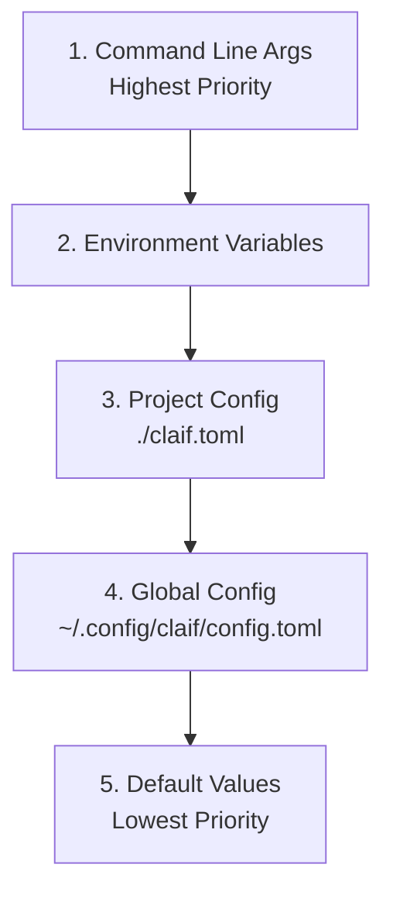

# Configuration

Claif provides a flexible, layered configuration system that adapts to different environments and use cases. This guide covers all configuration options and best practices.

## Configuration Hierarchy

Claif uses a **priority-based configuration system** where values from higher-priority sources override lower-priority ones:



### Priority Order

1. **Command-line arguments** (`--provider claude`)
2. **Environment variables** (`CLAIF_PROVIDER=claude`)
3. **Project configuration** (`./claif.toml`)
4. **Global configuration** (`~/.config/claif/config.toml`)
5. **Default values** (built into the code)

## Configuration Files

### Global Configuration

Located at `~/.config/claif/config.toml` (or `%APPDATA%\claif\config.toml` on Windows):

```toml
[general]
provider = "claude"
timeout = 120
debug = false
log_level = "INFO"

[claude]
api_key = "${ANTHROPIC_API_KEY}"
model = "claude-3-sonnet-20240229"
max_tokens = 4096
temperature = 0.7

[gemini]
api_key = "${GOOGLE_API_KEY}"
model = "gemini-pro"
max_tokens = 2048

[codex]
api_key = "${OPENAI_API_KEY}"
model = "gpt-4"
max_tokens = 4096

[output]
format = "text"  # text, json, yaml
color = true
streaming = true
pager = "auto"

[mcp]
enabled = true
port = 3000
tools_dir = "~/.config/claif/tools"
```

### Project Configuration

Create a `claif.toml` file in your project directory for project-specific settings:

```toml
[general]
provider = "gemini"  # Use Gemini for this project
debug = true

[gemini]
model = "gemini-pro"
temperature = 0.2    # Lower temperature for code projects

[output]
format = "json"      # JSON output for scripting
color = false        # No colors in CI/CD

# Project-specific tool configuration
[mcp]
tools_dir = "./tools"
enabled = true
```

## Environment Variables

All configuration values can be set via environment variables using the `CLAIF_` prefix:

### General Settings

```bash
export CLAIF_PROVIDER="claude"
export CLAIF_TIMEOUT="120"
export CLAIF_DEBUG="true"
export CLAIF_LOG_LEVEL="DEBUG"
```

### Provider API Keys

```bash
# Direct API key variables (preferred)
export ANTHROPIC_API_KEY="your-claude-key"
export GOOGLE_API_KEY="your-gemini-key"
export OPENAI_API_KEY="your-openai-key"

# Or using CLAIF_ prefix
export CLAIF_CLAUDE_API_KEY="your-claude-key"
export CLAIF_GEMINI_API_KEY="your-gemini-key"
export CLAIF_CODEX_API_KEY="your-openai-key"
```

### Provider Models

```bash
export CLAIF_CLAUDE_MODEL="claude-3-opus-20240229"
export CLAIF_GEMINI_MODEL="gemini-pro"
export CLAIF_CODEX_MODEL="gpt-4-turbo"
```

### Output Settings

```bash
export CLAIF_OUTPUT_FORMAT="json"
export CLAIF_OUTPUT_COLOR="false"
export CLAIF_OUTPUT_STREAMING="true"
```

## Command-Line Configuration

### Using the config Command

```bash
# View all configuration
claif config show

# View specific section
claif config show claude

# Set a value
claif config set general.provider claude
claif config set claude.model claude-3-opus-20240229

# Set nested values
claif config set output.format json

# Unset a value (revert to default)
claif config unset claude.temperature

# Reset all configuration
claif config reset

# Reset specific section
claif config reset claude
```

### Inline Configuration

Override settings for a single command:

```bash
# Use different provider
claif ask --provider gemini "Hello world"

# Use different model
claif ask --model claude-3-opus "Complex reasoning task"

# Change output format
claif ask --format json "What is AI?"

# Multiple overrides
claif ask --provider claude --model claude-3-sonnet --temperature 0.1 "Code review"
```

## Provider-Specific Configuration

### Claude (Anthropic)

```toml
[claude]
api_key = "${ANTHROPIC_API_KEY}"
model = "claude-3-sonnet-20240229"  # claude-3-opus, claude-3-haiku
max_tokens = 4096
temperature = 0.7
top_p = 1.0
top_k = 5
system_prompt = "You are a helpful assistant."

# Advanced Claude settings
max_retries = 3
retry_delay = 1.0
timeout = 120
stream = true
```

Available Claude models:
- `claude-3-opus-20240229` - Most capable, slower
- `claude-3-sonnet-20240229` - Balanced performance
- `claude-3-haiku-20240307` - Fastest, most cost-effective

### Gemini (Google)

```toml
[gemini]
api_key = "${GOOGLE_API_KEY}"
model = "gemini-pro"
max_tokens = 2048
temperature = 0.7
top_p = 0.8
top_k = 40

# Gemini safety settings
safety_settings = [
    { category = "HARM_CATEGORY_HARASSMENT", threshold = "BLOCK_MEDIUM_AND_ABOVE" },
    { category = "HARM_CATEGORY_HATE_SPEECH", threshold = "BLOCK_MEDIUM_AND_ABOVE" }
]

# Multimodal support
vision_enabled = true
max_image_size = "10MB"
```

Available Gemini models:
- `gemini-pro` - Text and code generation
- `gemini-pro-vision` - Multimodal (text + images)
- `gemini-flash` - Fast responses, lower cost

### Codex (OpenAI)

```toml
[codex]
api_key = "${OPENAI_API_KEY}"
model = "gpt-4"
max_tokens = 4096
temperature = 0.7
top_p = 1.0
frequency_penalty = 0.0
presence_penalty = 0.0

# OpenAI organization (if applicable)
organization = "org-your-org-id"

# Function calling
tools_enabled = true
function_timeout = 30
```

Available models:
- `gpt-4` - Most capable
- `gpt-4-turbo` - Faster, same capabilities
- `gpt-3.5-turbo` - Cost-effective, good performance

## Output Configuration

### Format Options

```toml
[output]
format = "text"    # text, json, yaml, markdown
color = true       # Enable colored output
streaming = true   # Stream responses in real-time
pager = "auto"     # auto, always, never
width = 80         # Terminal width for wrapping
```

### Text Output

```toml
[output.text]
wrap = true
indent = 2
bullet = "•"
numbered = false
```

### JSON Output

```toml
[output.json]
pretty = true
sort_keys = true
indent = 2
```

### YAML Output

```toml
[output.yaml]
default_flow_style = false
indent = 2
width = 80
```

## MCP (Model Context Protocol) Configuration

### Basic MCP Settings

```toml
[mcp]
enabled = true
port = 3000
host = "localhost"
tools_dir = "~/.config/claif/tools"
auto_discover = true
```

### Tool Configuration

```toml
[mcp.tools.calculator]
enabled = true
timeout = 10

[mcp.tools.file_reader]
enabled = true
allowed_paths = ["/home/user/documents", "/home/user/projects"]
max_file_size = "1MB"

[mcp.tools.web_search]
enabled = false  # Disable if not needed
api_key = "${SEARCH_API_KEY}"
```

## Logging Configuration

### Log Levels

```toml
[logging]
level = "INFO"     # DEBUG, INFO, WARNING, ERROR, CRITICAL
format = "detailed"  # simple, detailed, json
file = "~/.config/claif/claif.log"
max_size = "10MB"
backup_count = 5
```

### Provider-Specific Logging

```toml
[logging.providers.claude]
level = "DEBUG"
log_requests = true
log_responses = false  # Don't log responses (privacy)

[logging.providers.gemini]
level = "INFO"
log_requests = false
```

## Security Configuration

### API Key Management

```toml
[security]
# Never log API keys
log_api_keys = false

# Encrypt stored API keys (requires keyring)
encrypt_keys = true

# API key validation
validate_keys_on_startup = true
```

### File Permissions

```bash
# Secure configuration files
chmod 600 ~/.config/claif/config.toml
chmod 700 ~/.config/claif/
```

## Environment-Specific Configuration

### Development Environment

```toml
# development.toml
[general]
debug = true
log_level = "DEBUG"

[output]
color = true
format = "text"

[claude]
model = "claude-3-haiku-20240307"  # Faster for dev
temperature = 0.1
```

### Production Environment

```toml
# production.toml
[general]
debug = false
log_level = "WARNING"
timeout = 60

[output]
color = false
format = "json"

[claude]
model = "claude-3-sonnet-20240229"
max_retries = 5
retry_delay = 2.0
```

### CI/CD Environment

```bash
# CI environment variables
export CLAIF_DEBUG="false"
export CLAIF_OUTPUT_COLOR="false"
export CLAIF_OUTPUT_FORMAT="json"
export CLAIF_TIMEOUT="300"
```

## Configuration Validation

### Validate Current Configuration

```bash
# Check all configuration
claif config validate

# Check specific provider
claif config validate --provider claude

# Show configuration sources
claif config show --sources

# Test configuration
claif config test
```

### Configuration Schema

Claif validates configuration against a schema:

```python
# Example validation output
✓ Configuration is valid
✓ All required API keys are present
✓ All models are supported
⚠ Warning: Using development model in production
✗ Error: Invalid timeout value (must be > 0)
```

## Advanced Configuration

### Custom Provider Configuration

```toml
[providers.my_custom_provider]
api_url = "https://api.example.com/v1"
api_key = "${CUSTOM_API_KEY}"
model = "custom-model-v1"
headers = { "X-Custom-Header" = "value" }
```

### Proxy Configuration

```toml
[network]
proxy = "http://proxy.company.com:8080"
verify_ssl = true
timeout = 120
max_retries = 3

[network.headers]
User-Agent = "Claif/1.0.0"
X-Client-Version = "1.0.0"
```

### Performance Tuning

```toml
[performance]
# Connection pooling
max_connections = 10
keep_alive = true

# Caching
cache_enabled = true
cache_size = "100MB"
cache_ttl = 3600  # 1 hour

# Parallel processing
max_concurrent_requests = 5
```

## Configuration Best Practices

### 1. Use Environment Variables for Secrets

```bash
# Good: Environment variables
export ANTHROPIC_API_KEY="your-secret-key"

# Bad: Plain text in config files
# api_key = "your-secret-key"  # Don't do this
```

### 2. Project-Specific Settings

```toml
# Use project-specific claif.toml for:
# - Model preferences
# - Output formats
# - Debug settings
# - Tool configurations
```

### 3. Environment-Specific Configs

```bash
# Development
cp config/development.toml ~/.config/claif/config.toml

# Production
cp config/production.toml ~/.config/claif/config.toml
```

### 4. Configuration Versioning

```bash
# Version control your project configs
git add claif.toml

# But never commit secrets
echo "*.env" >> .gitignore
echo "config/secrets.toml" >> .gitignore
```

## Troubleshooting Configuration

### Common Issues

#### API Key Not Found

```bash
# Check if key is set
claif config show claude.api_key

# Verify environment variable
echo $ANTHROPIC_API_KEY

# Test key validity
claif doctor --provider claude
```

#### Provider Not Available

```bash
# Check installed providers
claif providers list

# Install missing provider
uv pip install claif_cla

# Refresh provider cache
claif providers refresh
```

#### Configuration Conflicts

```bash
# Show configuration sources
claif config show --sources

# Reset to defaults
claif config reset

# Validate after changes
claif config validate
```

### Debug Configuration

```bash
# Enable debug mode
claif --debug config show

# Trace configuration loading
CLAIF_DEBUG=true claif config show

# Show effective configuration
claif config effective
```

## Migration and Backup

### Backup Configuration

```bash
# Backup current config
cp ~/.config/claif/config.toml ~/.config/claif/config.toml.backup

# Export configuration
claif config export > claif-config-backup.toml
```

### Import Configuration

```bash
# Import from backup
claif config import claif-config-backup.toml

# Merge configurations
claif config merge new-config.toml
```

## Summary

Effective configuration management enables:

- **Seamless provider switching** between different AI services
- **Environment-specific behavior** for development, testing, and production
- **Secure API key management** using environment variables
- **Project customization** via local configuration files
- **Team collaboration** with shared configuration standards

Next steps:

- [Providers](providers.md) - Learn about specific provider capabilities
- [CLI Usage](cli-usage.md) - Master command-line interface
- [API Reference](api-reference.md) - Programmatic configuration management