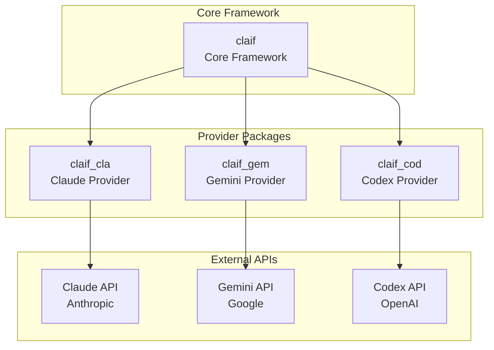
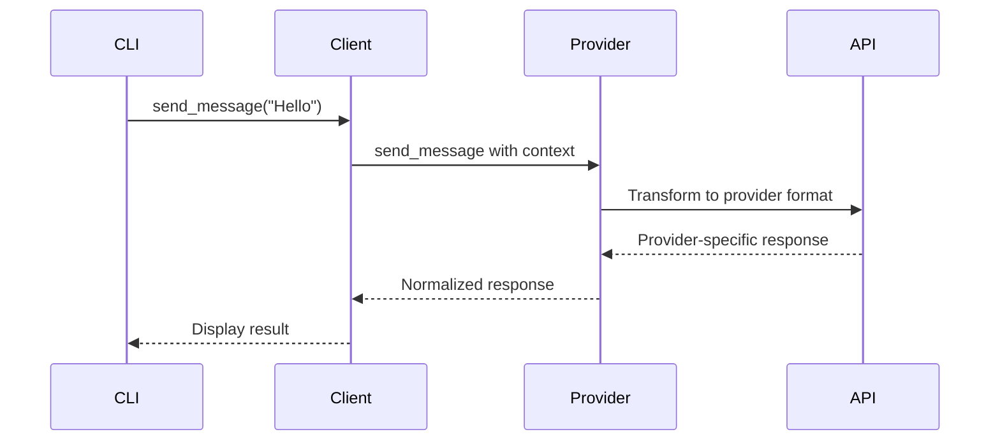

# Core Concepts

Understanding Claif's architecture and core concepts will help you make the most of the framework. This chapter covers the fundamental principles that make Claif powerful and flexible.

## Framework Architecture

### The Claif Ecosystem

Claif is designed as a **modular ecosystem** consisting of:



### Key Components

#### 1. Core Framework (`claif`)

The heart of the system providing:

- **Provider abstraction** - Unified interface for all AI providers
- **Plugin discovery** - Automatic detection of installed providers
- **Configuration management** - Centralized settings and preferences
- **CLI framework** - Fire-based command-line interface
- **MCP server** - Model Context Protocol integration
- **Error handling** - Consistent error management across providers

#### 2. Provider Packages

Specialized packages for each AI service:

- **`claif_cla`** - Anthropic Claude integration
- **`claif_gem`** - Google Gemini integration  
- **`claif_cod`** - OpenAI Codex integration

Each provider package implements the same interface but optimizes for its specific API.

## Provider System

### Provider Interface

All providers implement a common interface defined in `claif.providers.base.Provider`:

```python
from abc import ABC, abstractmethod
from typing import AsyncIterator
from claif.common.types import Message, ProviderConfig

class Provider(ABC):
    @abstractmethod
    async def send_message(
        self, 
        message: str, 
        context: list[Message] = None
    ) -> str:
        """Send a message and get response"""
        
    @abstractmethod
    async def stream_message(
        self, 
        message: str, 
        context: list[Message] = None
    ) -> AsyncIterator[str]:
        """Stream response tokens"""
        
    @abstractmethod
    def validate_config(self, config: ProviderConfig) -> bool:
        """Validate provider configuration"""
```

### Provider Discovery

Claif uses Python **entry points** for automatic provider discovery:

```toml
# In provider package's pyproject.toml
[project.entry-points."claif.providers"]
claude = "claif_cla:ClaudeProvider"
gemini = "claif_gem:GeminiProvider"
codex = "claif_cod:CodexProvider"
```

When you run `claif providers list`, the framework scans for all installed packages with `claif.providers` entry points.

### Provider Selection

Providers can be selected in multiple ways:

1. **Default provider** (from configuration)
2. **Command-line flag** (`--provider`)
3. **Environment variable** (`CLAIF_PROVIDER`)
4. **Programmatic selection** (Python API)

```bash
# Using default provider
claif ask "Hello"

# Override with flag
claif ask --provider gemini "Hello"

# Set via environment
CLAIF_PROVIDER=claude claif ask "Hello"
```

## Message System

### Message Types

Claif uses structured message types for communication:

```python
from enum import Enum
from dataclasses import dataclass
from typing import Optional

class MessageRole(Enum):
    USER = "user"
    ASSISTANT = "assistant"
    SYSTEM = "system"

@dataclass
class Message:
    role: MessageRole
    content: str
    metadata: Optional[dict] = None
    timestamp: Optional[str] = None
```

### Context Management

Messages are organized into **conversations** with persistent context:

```python
# Example conversation context
context = [
    Message(role=MessageRole.SYSTEM, content="You are a helpful assistant"),
    Message(role=MessageRole.USER, content="What is Python?"),
    Message(role=MessageRole.ASSISTANT, content="Python is a programming language..."),
    Message(role=MessageRole.USER, content="How do I install it?")
]
```

### Message Flow



## Configuration System

### Configuration Hierarchy

Claif uses a **layered configuration system**:

1. **Default values** (built into the code)
2. **Global config file** (`~/.config/claif/config.toml`)
3. **Project config file** (`./claif.toml`)
4. **Environment variables** (`CLAIF_*`)
5. **Command-line arguments** (highest priority)

### Configuration Structure

```toml
# Example claif.toml
[general]
provider = "claude"
timeout = 120
debug = false

[claude]
api_key = "${ANTHROPIC_API_KEY}"
model = "claude-3-sonnet-20240229"
max_tokens = 4096

[gemini]
api_key = "${GOOGLE_API_KEY}"
model = "gemini-pro"

[output]
format = "text"  # text, json, yaml
color = true
streaming = true
```

### Environment Variable Support

Configuration values support environment variable expansion:

```toml
api_key = "${ANTHROPIC_API_KEY}"  # Expands to env var value
timeout = "${CLAIF_TIMEOUT:120}"  # With default fallback
```

## Async Architecture

### Non-Blocking Operations

Claif is built on **asyncio** for non-blocking operations:

```python
import asyncio
from claif import ClaifClient

async def main():
    client = ClaifClient()
    
    # Non-blocking message sending
    response = await client.send_message("Hello")
    
    # Parallel queries to multiple providers
    tasks = [
        client.send_message("What is AI?", provider="claude"),
        client.send_message("What is AI?", provider="gemini"),
    ]
    results = await asyncio.gather(*tasks)

asyncio.run(main())
```

### Streaming Support

Real-time response streaming:

```python
async def stream_example():
    client = ClaifClient()
    
    async for token in client.stream_message("Write a story"):
        print(token, end="", flush=True)
```

## Error Handling

### Error Hierarchy

Claif defines a comprehensive error hierarchy:

```python
from claif.common.errors import (
    ClaifError,           # Base exception
    ProviderError,        # Provider-specific errors
    ConfigurationError,   # Configuration issues
    AuthenticationError,  # API key problems
    RateLimitError,      # API rate limiting
    NetworkError,        # Connection issues
)
```

### Graceful Degradation

When errors occur, Claif attempts **graceful degradation**:

1. **Retry logic** with exponential backoff
2. **Fallback providers** when primary fails
3. **Partial results** when possible
4. **Helpful error messages** with suggested fixes

## Plugin System

### Entry Points

Claif uses **setuptools entry points** for extensibility:

```toml
[project.entry-points."claif.providers"]
my_provider = "my_package:MyProvider"

[project.entry-points."claif.tools"]
my_tool = "my_package:MyTool"
```

### Custom Providers

You can create custom providers by implementing the base interface:

```python
from claif.providers.base import Provider

class MyCustomProvider(Provider):
    async def send_message(self, message: str, context=None) -> str:
        # Your custom implementation
        return "Custom response"
```

## MCP Integration

### Model Context Protocol

Claif supports **MCP** for tool integration:

```python
from claif.server import MCPServer

# Start MCP server
server = MCPServer()
await server.start()

# Register tools
@server.tool("calculator")
async def calculate(expression: str) -> str:
    """Evaluate mathematical expressions"""
    return str(eval(expression))  # Note: Use safely in production
```

### Tool Discovery

MCP tools are automatically discovered and available to providers:

```bash
# List available tools
claif tools list

# Use tools in queries
claif ask "Calculate 15 * 23 using the calculator tool"
```

## Best Practices

### 1. Provider Independence

Write code that works with any provider:

```python
# Good: Provider-agnostic
client = ClaifClient()
response = await client.send_message("Hello")

# Avoid: Provider-specific assumptions
# Don't assume Claude-specific features in generic code
```

### 2. Configuration Management

Use the configuration system effectively:

```python
# Load configuration
from claif.common.config import get_config

config = get_config()
provider = config.get("general.provider", "claude")
```

### 3. Error Handling

Always handle potential errors:

```python
from claif.common.errors import ProviderError, NetworkError

try:
    response = await client.send_message("Hello")
except NetworkError:
    print("Network connection failed")
except ProviderError as e:
    print(f"Provider error: {e}")
```

### 4. Async Best Practices

Use async/await properly:

```python
# Good: Proper async context
async def process_messages():
    client = ClaifClient()
    for message in messages:
        response = await client.send_message(message)
        yield response

# Avoid: Blocking in async context
# Don't use time.sleep() in async functions
```

## Summary

Understanding these core concepts enables you to:

- **Choose appropriate providers** for your use cases
- **Configure Claif effectively** for your workflow
- **Handle errors gracefully** in your applications
- **Extend functionality** through plugins and custom providers
- **Build robust applications** using async patterns

Next, dive deeper into specific topics:

- [Installation](installation.md) - Detailed setup instructions
- [Configuration](configuration.md) - Advanced configuration options
- [Providers](providers.md) - Provider-specific features and capabilities