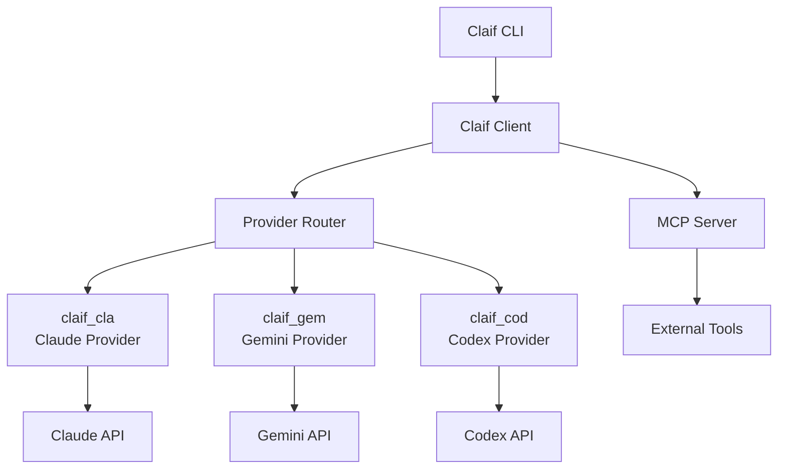

# Claif Documentation

Welcome to the **Claif** (Command-Line Artificial Intelligence Framework) documentation. Claif provides a unified interface for interacting with various large language models (LLMs) from the command line.

## Table of Contents

### Quick Navigation

1. **[Getting Started](getting-started.md)** - Installation and first steps
2. **[Core Concepts](core-concepts.md)** - Understanding Claif's architecture
3. **[Installation](installation.md)** - Detailed installation guide
4. **[Configuration](configuration.md)** - Setting up providers and preferences
5. **[Providers](providers.md)** - Available LLM providers and their features
6. **[CLI Usage](cli-usage.md)** - Command-line interface reference
7. **[API Reference](api-reference.md)** - Python API documentation
8. **[Development](development.md)** - Contributing and extending Claif
9. **[Troubleshooting](troubleshooting.md)** - Common issues and solutions

## TLDR

!!! tip "Quick Start"
    ```bash
    # Install Claif
    pip install claif
    
    # Configure a provider (example: Claude)
    claif config set provider claude
    claif config set claude.api_key YOUR_API_KEY
    
    # Start chatting
    claif chat "Hello, world!"
    ```

### What is Claif?

Claif is a **unified command-line interface** for multiple AI providers including:

- **Claude** (Anthropic) - via `claif_cla` package
- **Gemini** (Google) - via `claif_gem` package  
- **Codex** (OpenAI) - via `claif_cod` package

### Key Features

- 🔄 **Provider Abstraction** - Switch between AI providers seamlessly
- 🔌 **Plugin Architecture** - Extensible through Python entry points
- ⚡ **Async Operations** - Non-blocking API calls and parallel queries
- 🛠️ **MCP Integration** - Model Context Protocol server support
- 📊 **Rich CLI** - Beautiful terminal output with Fire framework
- 🔧 **Configuration Management** - Flexible config system with environment variables
- 📝 **Comprehensive Logging** - Loguru-based logging with provider contexts

### Architecture Overview



### Quick Examples

=== "Simple Query"
    ```bash
    claif ask "What is the capital of France?"
    ```

=== "Code Generation"
    ```bash
    claif code "Write a Python function to calculate fibonacci numbers"
    ```

=== "File Processing"
    ```bash
    claif analyze README.md "Summarize this file"
    ```

=== "Interactive Mode"
    ```bash
    claif chat --interactive
    ```

## Next Steps

- **New users**: Start with [Getting Started](getting-started.md)
- **Developers**: Check out [Development](development.md)
- **Advanced users**: Explore [API Reference](api-reference.md)

!!! info "Provider Packages"
    Remember that Claif is a framework. You'll need to install specific provider packages like `claif_cla`, `claif_gem`, or `claif_cod` to actually use AI services.